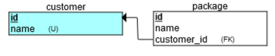

# LG-nason-tech-challenge
Welcome! You've been contracted by **Blast Off Catering** :rocket: to develop a web application that will display customer catering orders. Your contract states that the application is to be finished no later than **Friday, October 19th, 2018, at 4:00PM**. All code should be committed to the GitHub repository as detailed in the instructions below. [@denningk](https://github.com/denningk) is your point of contact for this project. He can be contacted through the tech challenge slack channel after 6PM.

The application will have two pages: 
1. *Dashboard Landing Page* A dashboard that will list all current orders, sorted by customer. The orders should be in one table with two columns. The left column should contain all customers. Each cell in the right column should contain a bulleted list of all packages a customer has ordered. The dashboard will also contain a button that leads to the order submission page.
2. *Order Submission Page* A form for entering a new order. The form should have two text input fields: 
    * Customer Name
    * Catering Package Name

    The form should have a submit button.

## Setup Instructions
1. Install all necessary tools as listed in the *Tools* section below.
2. Create a GitHub account and post your username into the Slack channel.
3. Clone the repository using: 

    `git clone https://github.com/denningk/LG-nason-tech-challenge.git`

4. Change into the `LG-nason-tech-challenge` directory.
5. Create a new Django project using (notice the period at the end):

    `django-admin startproject catering_orders .` 

6. Notice the new files created using `ls`. Create new application using:

    `python manage.py startapp main`

7. Database models will go in `main/models.py`
8. Controller functions will go in `main/views.py`
9. Create a new directory `templates` in the root directory (`LG-nason-tech-challenge`).
10. Create two new directories in `templates`, `html` and `css`.
11. Place all template files in their appropriate directories in `templates`.
12. URL routes will go in `catering-orders/urls.py`.

## Project Submission Instructions

For all new features/bug fixes, create a new branch with the following naming format: `<your-github-username>/<short-description>`. Example: `denningk/add-instructions`.

Once a feature or bug fix has been tested, merge the branch with the `develop` branch. All pull requests require a review by [@denningk](https://github.com/denningk) before being merged. When the project is complete, a final merge will be done into the `master` branch.

## Database
The database should be created by adding models into `main/models.py` and then performing a migration as is done in the Django tutorial. The database will contain two tables:
* customer
* package

The entity relationship diagram for the database is shown below. **Remember** Django implicitly creates an *id* field for each entity. This *id* field does not need to be added to `main/models.py`.

Customer names are unique. If a form is a submitted with a customer name that is already in the database, that package should be assigned to that customer instead of creating a new one. Package names are arbitrary and are not unique.

## Tools
* Backend: Django Framework (Python 3)
* Frontend: HTML/CSS/JavaScript with Bootstrap 4 framework (use CDN for Bootstrap)
* Database: SQLite database (Included with Django)
* Version Control: Git/GitHub
* Text Editor: [Visual Studio Code](https://code.visualstudio.com/) w/ Python extension (Optional)

## Resources
You may receive help from anyone or from any website online. You may ask questions to [@denningk](https://github.com/denningk) in the slack channel or by tagging him in comments on GitHub after 6PM. While you may copy and paste code for generic functionality, you should be the only person typing into your text editor. Please ask for help, it will be more difficult to complete this project on your own.

### Django
[Installation and Tutorial](https://www.djangoproject.com/start/)
### Bootstrap
[Documentation](https://getbootstrap.com/docs/4.0/getting-started/introduction/)
### HTML & CSS
Jon Duckett's book available [online](https://wlu.primo.exlibrisgroup.com/discovery/fulldisplay?docid=alma991010340799304161&context=L&vid=01WLU_INST:01WLU&lang=en&search_scope=MyInst_and_CI&adaptor=Local%20Search%20Engine&tab=Everything&query=any,contains,jon%20duckett&sortby=rank&mode=Basic) through W&L.

## Testing
The website should run on a local machine. Run `python manage.py runserver` while in the project directory. The application will then be accessible from `http://127.0.0.1:8000/`

Have fun!
